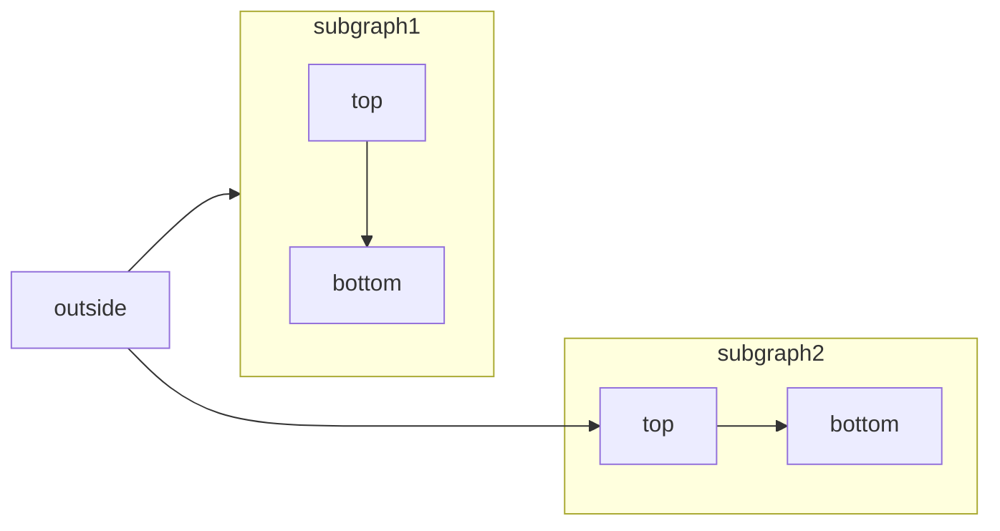
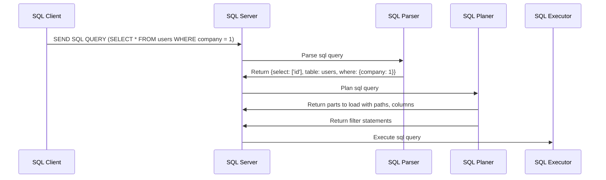

```mermaid
flowchart LR
    subgraph subgraph1
        direction TB
        top1[top] --> bottom1[bottom]
    end
    subgraph subgraph2
        direction TB
        top2[top] --> bottom2[bottom]
    end
    %% ^ These subgraphs are identical, except for the links to them:

    %% Link *to* subgraph1: subgraph1 direction is maintained
    outside --> subgraph1
    %% Link *within* subgraph2:
    %% subgraph2 inherits the direction of the top-level graph (LR)
    outside ---> top2
```

```mermaid
sequenceDiagram
  participant  C as SQL Client
  participant  S as SQL Server
  participant  PQ as SQL Parser
  participant  P as SQL Planer
  participant  E as SQL Executor
  
  C->>S: SEND SQL QUERY (SELECT * FROM users WHERE company = 1)
  S->>PQ: Parse sql query
  PQ->>S: Return {select: ['id'], table: users, where: {company: 1}}
  S->>P: Plan sql query
  P->>S: Return parts to load with paths, columns
  P->>S: Return filter statements
  S->>E: Execute sql query

```
