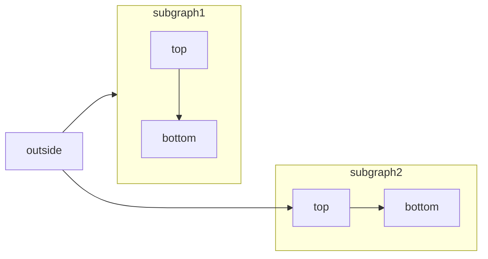
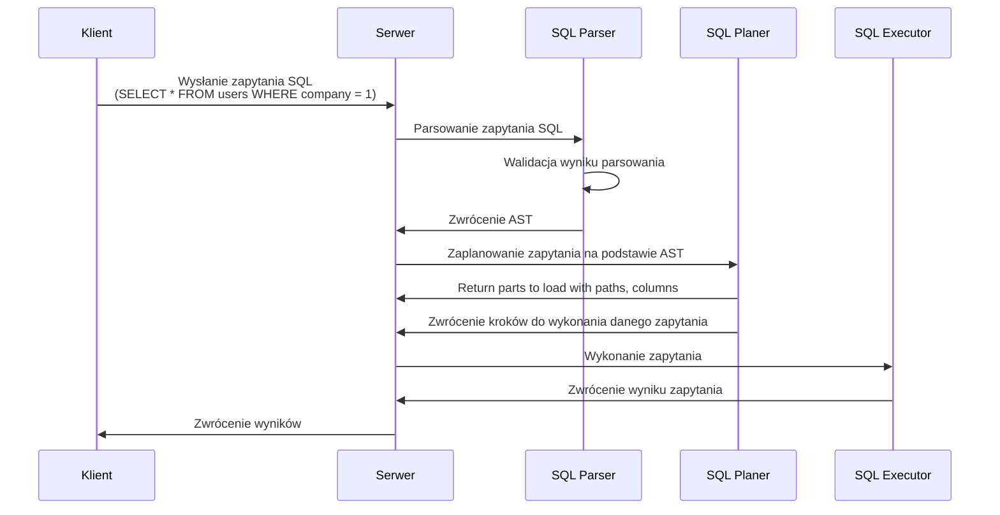

```mermaid
flowchart LR
    subgraph subgraph1
        direction TB
        top1[top] --> bottom1[bottom]
    end
    subgraph subgraph2
        direction TB
        top2[top] --> bottom2[bottom]
    end
    %% ^ These subgraphs are identical, except for the links to them:

    %% Link *to* subgraph1: subgraph1 direction is maintained
    outside --> subgraph1
    %% Link *within* subgraph2:
    %% subgraph2 inherits the direction of the top-level graph (LR)
    outside ---> top2
```

```mermaid
sequenceDiagram
  participant  C as Klient
  participant  S as Serwer
  participant  PQ as SQL Parser
  participant  P as SQL Planer
  participant  E as SQL Executor
  
  C->>S: Wysłanie zapytania SQL <br>(SELECT * FROM users WHERE company = 1)
  S->>PQ: Parsowanie zapytania SQL
  PQ->>PQ: Walidacja wyniku parsowania
  PQ->>S: Zwrócenie AST
  S->>P: Zaplanowanie zapytania na podstawie AST
  P->>S: Return parts to load with paths, columns
  P->>S: Zwrócenie kroków do wykonania danego zapytania
  S->>E: Wykonanie zapytania
  E->>S: Zwrócenie wyniku zapytania
  S->>C: Zwrócenie wyników

```
